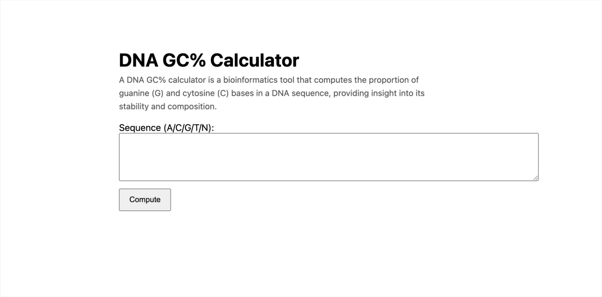

# DNA GC% Calculator — FastAPI + Vanilla JS

- Backend: FastAPI (`/ping`, `POST /gc`) on Railway  
- Frontend: HTML/CSS/JS on GitHub Pages (`/docs`)

## Railway

Health: /ping

## URL

[URL](https://gsopas.github.io/dna-gc-fastapi-vanilla/)

## gif

